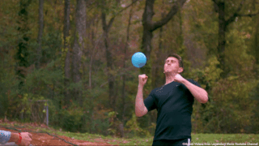
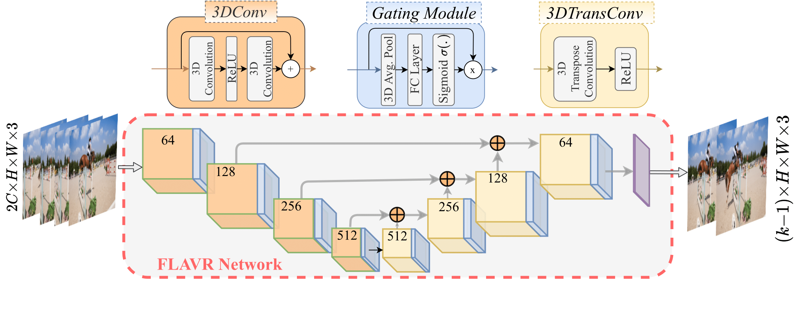

# FLAVR: Flow-Agnostic Video Representations for Fast Frame Interpolation
## WACV 2023 (Best Paper Finalist)




[[project page](https://tarun005.github.io/FLAVR/)] [[paper](https://arxiv.org/pdf/2012.08512.pdf)] [[Project Video](youtu.be/HFOY7CGpJRM)]

FLAVR is a fast, flow-free frame interpolation method capable of single shot multi-frame prediction. It uses a customized encoder decoder architecture with spatio-temporal convolutions and channel gating to capture and interpolate complex motion trajectories between frames to generate realistic high frame rate videos. This repository contains original source code.

## Inference Times

FLAVR delivers a better trade-off between speed and accuracy compared to prior frame interpolation methods.

Method        | FPS on 512x512 Image (sec)
| ------------- |:-------------:|
| FLAVR       | 3.10  |
| SuperSloMo | 3.33 |
| QVI      |   1.02  |
| DAIN |   0.77  |

## Dependencies

We used the following to train and test the model.

- Ubuntu 18.04
- Python==3.7.4
- numpy==1.19.2
- [PyTorch](http://pytorch.org/)==1.5.0, torchvision==0.6.0, cudatoolkit==10.1

## Model

<center></center>

## Training model on Vimeo-90K septuplets

For training your own model on the Vimeo-90K dataset, use the following command. You can download the dataset from [this link](http://toflow.csail.mit.edu/). The results reported in the paper are trained using 8GPUs.
``` bash
python main.py --batch_size 32 --test_batch_size 32 --dataset vimeo90K_septuplet --loss 1*L1 --max_epoch 200 --lr 0.0002 --data_root <dataset_path> --n_outputs 1
```

Training on GoPro dataset is similar, change `n_outputs` to 7 for 8x interpolation.

## Testing using trained model.

### Trained Models.
You can download the pretrained FLAVR models from the following links.
 Method        | Trained Model  |
| ------------- |:-----|
| **2x** | [Link](https://drive.google.com/drive/folders/1M6ec7t59exOSlx_Wp6K9_njBlLH2IPBC?usp=sharing) |
| **4x** |   [Link](https://drive.google.com/file/d/1btmNm4LkHVO9gjAaKKN9CXf5vP7h4hCy/view?usp=sharing)   |
| **8x** |   [Link](https://drive.google.com/drive/folders/1Gd2l69j7UC1Zua7StbUNcomAAhmE-xFb?usp=sharing)  |

### 2x Interpolation
For testing a pretrained model on Vimeo-90K septuplet validation set, you can run the following command:
```bash
python test.py --dataset vimeo90K_septuplet --data_root <data_path> --load_from <saved_model> --n_outputs 1
```

### 8x Interpolation
For testing a multiframe interpolation model, use the same command as above with multiframe FLAVR model, with `n_outputs` changed accordingly.

### Time Benchmarking
The testing script, in addition to computing PSNR and SSIM values, will also output the inference time and speed for interpolation. 

### Evaluation on Middleburry

To evaluate on the public benchmark of Middleburry, run the following.
```bash
python Middleburry_Test.py --data_root <data_path> --load_from <model_path> 
```

The interpolated images will be saved to the folder `Middleburry` in a format that can be readily uploaded to the [leaderboard](https://vision.middlebury.edu/flow/eval/results/results-i2.php). 

## SloMo-Filter on custom video

You can use our trained models and apply the slomo filter on your own video (requires OpenCV 4.2.0). Use the following command. If you want to convert a 30FPS video to 240FPS video, simply use the command
```bash
python interpolate.py --input_video <input_video> --factor 8 --load_model <model_path>
```

by using our [pretrained model](https://drive.google.com/drive/folders/1Gd2l69j7UC1Zua7StbUNcomAAhmE-xFb?usp=sharing) for 8x interpolation. For converting a 30FPS video to 60FPS video, use a 2x model with `factor` 2.

## Baseline Models

We also train models for many other previous works on our setting, and provide models for all these methods. Complete benchmarking scripts will also be released soon.

 Method        | PSNR on Vimeo           | Trained Model  |
| ------------- |:-------------:| -----:|
| FLAVR       | 36.3    | [Model](https://drive.google.com/drive/folders/1M6ec7t59exOSlx_Wp6K9_njBlLH2IPBC?usp=sharing)
| AdaCoF      | 35.3 | [Model](https://drive.google.com/file/d/19Y2TDZkSbRgNu-OItvqk3qn5cBWGg1RT/view?usp=sharing) |
| QVI*      |   35.15    | [Model](https://drive.google.com/file/d/1v2u5diGcvdTLhck8Xwu0baI4zm0JBJhI/view?usp=sharing)   |
| DAIN |   34.19   | [Model](https://drive.google.com/file/d/1RfrwrHoSX_3RIdsoQgPg9IfGAJRhOoEp/view?usp=sharing)  |
| SuperSloMo* | 32.90 | [Model](https://drive.google.com/file/d/1dR2at5DQO7w5s2tA5stC95Nmu_ezsPth/view?usp=sharing)

* SuperSloMo is implemented using code repository from [here](https://github.com/avinashpaliwal/Super-SloMo). Other baselines are implemented using the official codebases. 
* The numbers presented here for the baselines are slightly better than those reported in the paper.

## Google Colab

A Colab notebook to try 2x slow-motion filtering on custom videos is available in the *notebooks* directory of this repo.

## Model for Motion-Magnification

Unfortunately, we cannot provide the trained models for motion-magnification at this time. We are working towards making a model available soon.

## Acknowledgement

The code is heavily borrowed from Facebook's official [PyTorch video repository](https://github.com/facebookresearch/VMZ) and [CAIN](https://github.com/myungsub/CAIN).

## Cite

If this code helps in your work, please consider citing us. 
``` text
@article{kalluri2021flavr,
  title={FLAVR: Flow-Agnostic Video Representations for Fast Frame Interpolation},
  author={Kalluri, Tarun and Pathak, Deepak and Chandraker, Manmohan and Tran, Du},
  booktitle={arxiv},
  year={2021}
}
```
